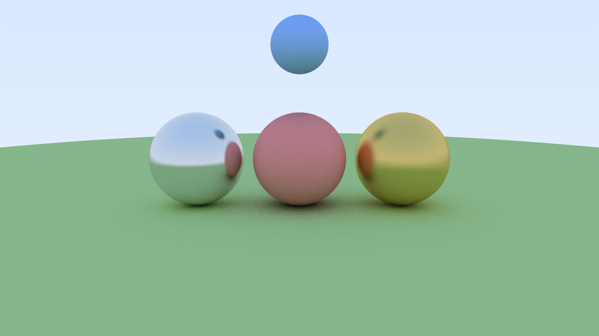

# CUDA Path Tracer

A physically-based path tracer built from scratch in CUDA C++, running entirely 
on the GPU. Implements real ray tracing with realistic lighting, reflections, 
and refractions.



## Performance

| Resolution | Samples Per Pixel | Render Time |
|------------|-------------------|-------------|
| 1200x675   | 128               | 9.11ms      |

> GPU: NVIDIA RTX 5070 Ti | CUDA 13.2

## Features

- **Diffuse materials** — Lambertian scattering with random bounce
- **Metal materials** — Reflective surfaces with adjustable fuzziness
- **Glass materials** — Refraction with Schlick approximation for Fresnel effect
- **Multi-bounce lighting** — Rays bounce up to 8 times per sample
- **Anti-aliasing** — 128 samples per pixel with random sub-pixel sampling
- **Gamma correction** — Perceptually accurate output

## How It Works

Each pixel is assigned its own GPU thread. For every pixel, the tracer fires 
128 rays into the scene, bouncing them off surfaces and accumulating light. 
With a 1200x675 image that's over 100 million rays traced in parallel on the GPU.

## Project Structure
```
cuda-path-tracer/
├── src/
│   ├── pathtracer.cu      # Main render kernel
│   ├── vec3.h             # 3D vector math
│   └── ray.h              # Ray definition
├── output/
│   └── render.png         # Rendered output
└── README.md
```

## Build & Run

**Requirements:**
- NVIDIA GPU (CUDA capable)
- CUDA Toolkit 12+
- Visual Studio Build Tools 2022
```bash
cd src
nvcc pathtracer.cu -o pathtracer.exe -lcurand
pathtracer.exe
```

Output image saved to `output/render.png`